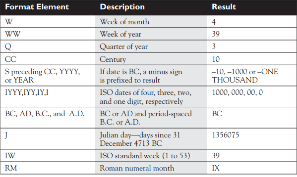

# Функции

LOWER - маленькими

UPPER - большими

INITCAP – с большой каждое слово

```sql
Select lower('SQL') from dual
```

`dual` - системная таблица, которая всегда возвращает 1 строку и 1 столбец. Вы можете сделать запрос и на любую другу таблицу, но если она содержит много данных, то в результате выполнения запроса будет много повторений

Вернёт на экран - sql

```sql
Select upper('sql') from dual
```

= SQL

```sql
Select initcap('sql') from dual
```

= Sql

**LENGTH** – размер

```sql
Select length('A short string') from dual
```

= 14

**CONCAT** – сложение строк (конкатинация)

```sql
Select concat('SQL is',' easy to learn.') from dual
```

= SQL is easy to learn.

**SUBSTR** – разделение входящей string (string, start, how many)

```sql
Select substr('http://www.domain.com',12,6) from dual
```

= domain

Query 3:

```sql
SELECT substr('1#3#5#7#9#',5) FROM dual;
```

С какого символа (5)

Query 4:

```sql
SELECT substr('1#3#5#7#9#',5,5) FROM dual;
```

С какого символа и сколько символов (5,5)

Query 5:

```sql
SELECT substr('1#3#5#7#9#',-3,2) FROM dual;
```

**INSTR** – позицию символа/ов, которые ищутся в string

```sql
SELECT instr('http://www.domain.com','.',1,2)  from dual
```

= 18

Query 3:

```sql
SELECT instr('1#3#5#7#9#','#') FROM dual;
```

Ищет первое совпадение

Query 4:

```sql
SELECT instr('1#3#5#7#9#','#',5) FROM dual;
```

Начинает искать с 5 символа

Query 5:

```sql
SELECT instr('1#3#5#7#9#','#',3,4) FROM dual;
```

Начинает искать с 3 символа и выводит на экран позицию 4 совпадения

**LPAD\*\*** , \***\* RPAD** – добавить символ/ы слева или справа до количества, указанного во 2 параметре

```sql
SELECT rpad('#PASSWORD#',11,'#') from dual
```

= #PASSWORD##

```sql
SELECT lpad('#PASSWORD#',11,'#') from dual
```

= ##PASSWORD#

```sql
SELECT lpad(1000+200.55,14,'*') FROM dual;
```

```sql
SELECT rpad(1000+200.55,14,'*') FROM dual;
```

```sql
SELECT lpad(SYSDATE,14,'$#') FROM dual;
```

```sql
SELECT rpad(SYSDATE,4,'$#') FROM dual;
```

**TRIM** – удаляет символы из стринги

trim('#' from '#PASSWORD#') = PASSWORD

Query 1:

```sql
SELECT trim(TRAILING 'e' FROM 1+2.14||' is pie') FROM dual;
```

Query 2:

```sql
SELECT trim(BOTH '*' FROM '*******Hidden*******') FROM dual;
```

Query 3:

```sql
SELECT trim(1 from sysdate) FROM dual;
```

**REPLACE** – меняет из стринги заданные символы/ы на другие

replace('#PASSWORD#','WORD','PORT') = #PASSPORT#

180 стр.

## Операции с числами\*\*

round(42.39,1) = 42.4 – округляет

trunc(42.39,1) = 42.3 – просто убирает не нужное

mod(42,10) = 2 – остаток от деления

## Операции с датами

**MONTHS_BETWEEN** – количество месяцев между двумя датами

months_between('01-FEB-2008','01-JAN-2008') = 1

**ADD_MONTHS** – добавляет к дате заданное количество месяцов

add_months('01-JAN-2008',1) = 01-FEB-2008

**LAST_DAY** – возвращает последний день в заданной дате

last_day('01-FEB-2008') = 29-FEB-2008

**NEXT_DAY** – следующий заданный день недели, когда

next_day('01-FEB-2008','Friday') = 08-FEB-2008

**SYSDATE** – возвращает дату в данный момент

sysdate = 17-DEC-2007

**ROUND** , **TRUNC** – ближайший день/месяц/год к дате.

round(sysdate,'month') = 01-JAN-2008

trunc(sysdate,'month') = 01-DEC-2007

**Конвертация типов**

TO_CHAR, TO_NUMBER, TO_DATE

Examples:

```sql
SELECT to_char(sysdate)||' is today''s date' FROM dual;
```

```sql
SELECT to_char(sysdate,'Month')||'is a special time' FROM dual;
```

```sql
SELECT to_char(sysdate,'fmMonth')||'is a special time' FROM dual;
```




**NVL2 function**

SELECT nvl2(null,1234,5678) FROM dual;

Если 1 аргумент не нулевой, то возвращается 2 аргумент, иначе – 3.

Функция NVL -

```sql
SELECT nvl2(null,1234) FROM dual;
```

Вернёт 1234 если первое значение не нулевое.

**The NULLIF Function**

Сравнивает 1 и 2 аргумент, если совпали – то null, если нет, то 1 аргумент.

**The COALESCE Function**

Возвращает первое ненулевое значение.

## Условные функции

**The DECODE Function**

If-then-else.

DECODE(expr1,comp1, iftrue1, [comp2,iftrue2...[compN,iftrueN]], [iffalse])

Сравнивает 1 аргумент со 2, 4, 6, 8 etc и возвращает 3,5,7 или 9 etc если 2,4, 6 или 8 совпали с 1. Выведетнаэкранпервыйпопавший.

**The CASE Expression**

```sql
SELECT
 CASE substr(1234,1,3)
 WHEN '134' THEN '1234 is a match'
 WHEN '1235' THEN '1235 is a match'
 WHEN concat('1','23') THEN concat('1','23')||' is a match'
 ELSE 'no match'
END
FROM dual;
```

Вернёт 123 is a match
