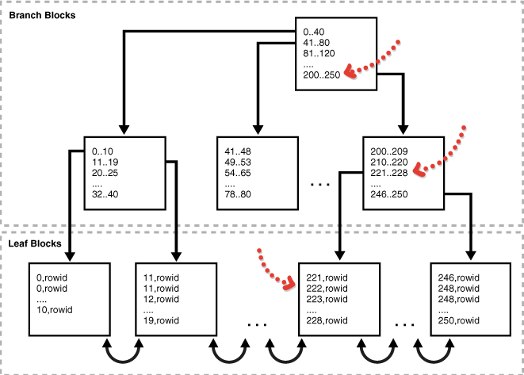

# Индексы

Индексы - важная часть баз данных. Именно благодаря им поиск в таблицах может осуществляться очень быстро. Пользователи не могут увидеть индексы, они только используются для ускорения поиска/запросов.

Однако индексами надо пользоваться аккуратно, т.к. в некоторых случае, при неправильном применении индексы наоборот могут показать результат хуже. Например, обновление таблицы с индексами займёт больше времени, что без, т.к. сами индексы тоже необходимо обновить. Поэтому необходимо использовать индексы на те атрибуты, по которым производится частый поиск.

Синтаксис создания индексов:

```sql
CREATE INDEX index_name
ON table_name (column1, column2, ...);
```

Есть несколько различных типов индексов.

Основной - это бинарное дерево.


Например, мы пишем запрос, который выбирает студента с заданными номером зачётки:

```sql
SELECT *
FROM students
WHERE n_z = 222;
```

Если у нас нет никакого индекса в таблице, то поиск будет осуществляться полным перебором. Что на небольших данных незаметно, но когда таблица вырастает в объеме - этот момент становится критичным.

Вообще, пока у вас небольшое количество данных, то проектировать таблицы вы можете как угодно. Разница в скорости выполнении запросов не будет заметно невооруженным взглядом. Но когда данных становится больше, то появляется множество проблем, который очень сложно решить, если были допущены грубые ошибки на начальном этапе создания.

В итоге, без индекса будет произведено полное сканирование таблицы. По порядку, отбрасывая те строки, которые не соответствуют заданному критерию и оставляя те, которые соответствуют.

С индексом поиск по нашему запросу будет осуществлён таким образом:



Получается, мы смотрим в какой диапазон попадает наше значение и двигаемся по дереву до листа, где хранится строка, которая нам нужна.

Итак, в общем случае индексы необходимо использовать на атрибуты, которые:

- часто запрашиваются и возвращают небольшой процент от общего числа кортежей в таблице;
- на индексированном столбце или столбцах есть ограничение ссылочной целостности. Индекс - способ избежать полной блокировки таблицы, которая была бы необходима в случае обновления первичного ключа родительской таблицы, слияния с родительской таблицей или удаления из родительской таблицы;
- в таблице есть уникальный ключ и вы хотите вручную указать индекс и все его параметры.

На первичный и уникальный ключ индексы создаются автоматически, на внешний ключ можно создать индекс руками.
